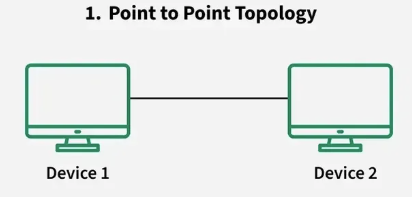
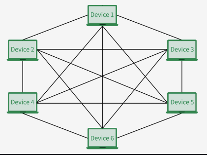

[< Go back](./OSI.md)

# Network Topology

###### referenced from [this site](https://www.geeksforgeeks.org/computer-networks/types-of-network-topology/)

> My method of learning that works for me is to type all the documents that i read. Sure i copied, But this is the way That i can remember and I also want to store it in my project. That's the reason.

A network topology is the arrangement of devices (nodes) and connections (links) in a computer network. It shows how computers, servers, and other devices are connected and how data flows between them. There are two main types of topology:

- **Physical Topology:** The actual physical layout of cables and devices.
- **Logical Topology:** How data moves across the network, regardless of physical layout.
  
> **Note:** Choosing the right topology is important because it affects the performance, cost, reliability, and security of the network.

## Point to Point Topology

Point-to-point topology is a type of topology that works on the functionality of the sender and receiver. It is the simplest communication between two nodes, in which one is the sender and the other one is the receiver. Point-to-Point provides high bandwidth.

## Mesh Topology

In a mesh topology, every device is connected to another device via a particular channel. Every device is connected to another via dedicated channels. These channels are known as links. In Mesh Topology, the protocols used are AHCP (Ad Hoc Configuration Protocols), DHCP (Dynamic Host Configuration Protocol), etc.

- Suppose, the N number of devices are connected with each other in a mesh topology, the total number of ports that are required by each device is ***N*** - **1**. In Figure, there are 6 devices connected to each other, hence the total number of ports required = N * (N-1).
- Suppose, N number of devices are connected with each other in a mesh topology then the total number of dedicated links required to connect them is N * (N-1)/2. In Figure, there are 6 devices connected to each other, hence the total number of links required is 6 * 5/2 = 15.

### Advantages of Mesh Topology

- Communication is very fast between the nodes.
- Mesh Topology is robust.
- The fault is diagnosed easily. Data is reliable because data is transferred among the devices through dedicated channels or links.
- Provices security and privacy.

### Disadvantages of Mesh Topology

- Installation and confuguration are difficult.
- The cost of cable is high as bulk wiring is required, hence suitable for less number of devices.
- The cost of maintenance is high.

> **Note:** A common example of mesh topology is the internet backbone, where various internet service providers are connected to each other via dedicated channels. This topology is also used in military communication systems and aircraft navigation systems.

